

  

Not your typical health app!

**JeffreyWooHealth** is a new operating system for your wellness — designed to help you achieve your dream body while building healthier, smarter eating habits.

## ✨ What Makes It Different
Most apps just count calories. **JeffreyWooHealth** goes further:  
- 🧠 **Personalized Plans** — tailored to your lifestyle and goals  
- 📸 **Snap & Track** — take a photo of your meal or scan a nutrition label for instant AI analysis  
- 📊 **Smarter Insights** — see your nutrition score, macros, and more — beyond just numbers  
- 💪 **Sustainable Habits** — tools to help you lose weight, gain muscle, or maintain balance  

## 🚀 Why Choose JeffreyWooHealth
Whether you want to slim down, build strength, or simply live better every day, **JeffreyWooHealth** is your AI-powered guide to lasting wellness. It’s based on experts' advice, works everywhere, and keeps your data secure.

## 📦 Getting Started
1. Upload or take a photo of your meal
2. Run **JeffreyWooHealth** to generate AI-powered nutrition insights
3. Track progress toward your health goals

## 🤖 Tech Stack
- **Language** — TypeScript  
- **Framework** — React (with Vite as the build tool)  
- **UI** — Standard React components

## ⚖️ Disclaimer
**JeffreyWooHealth** provides AI-driven insights for informational purposes only. It does not offer medical advice, diagnosis, or treatment. Please consult a qualified healthcare provider before making health-related decisions.

## ⚙️ Run Locally

**Prerequisites:**  Node.js

1. Install dependencies:
   `npm install`
2. Set the `GEMINI_API_KEY` in [.env.local](.env.local) file to your Gemini API key after you create [.env.local](.env.local) file
3. Run the app:
   `npm run dev`

## 📋 Sample

  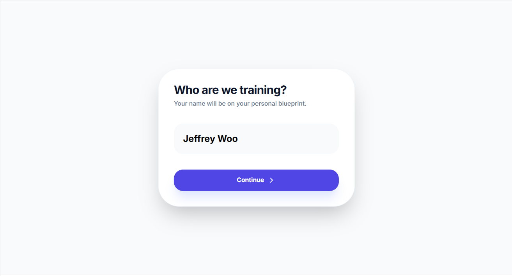
  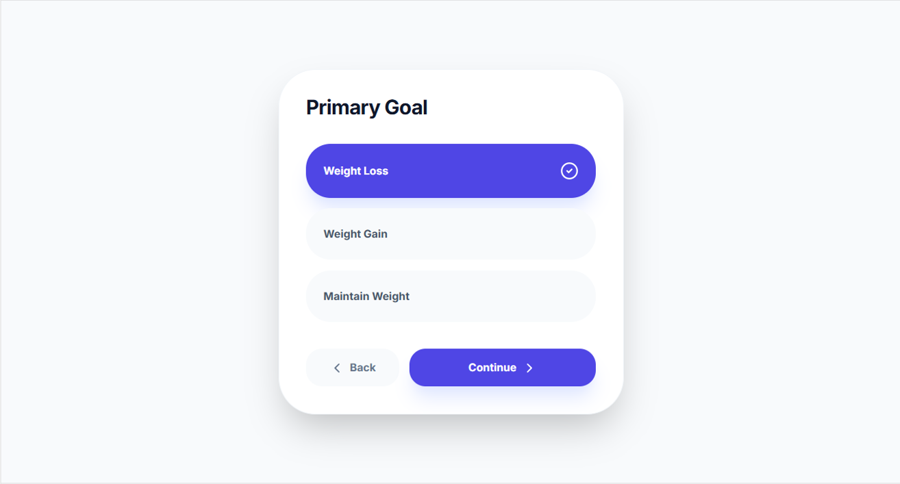
  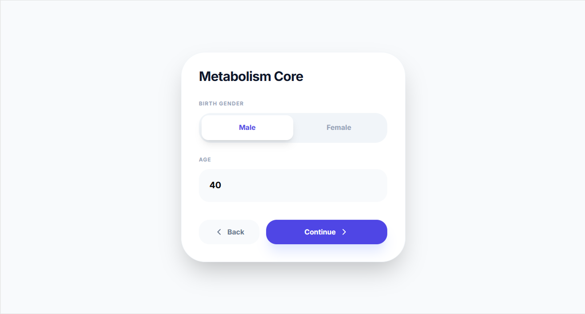
  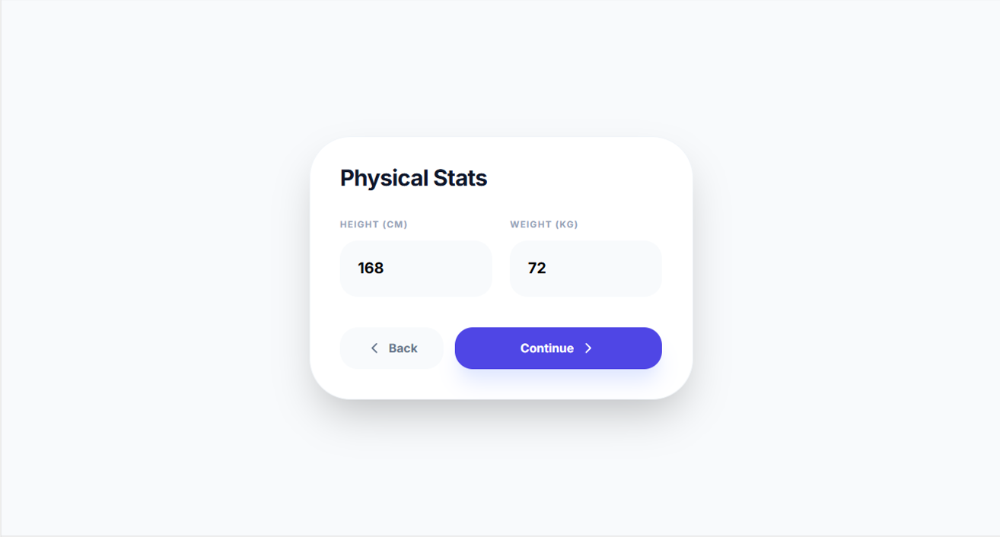
  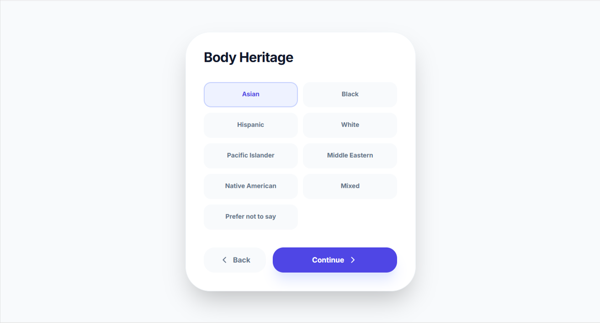
  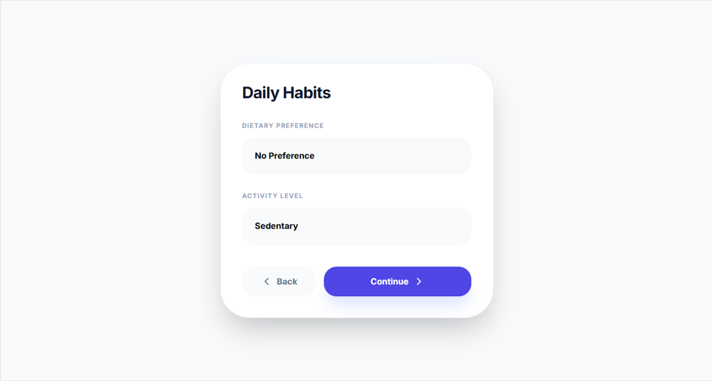
  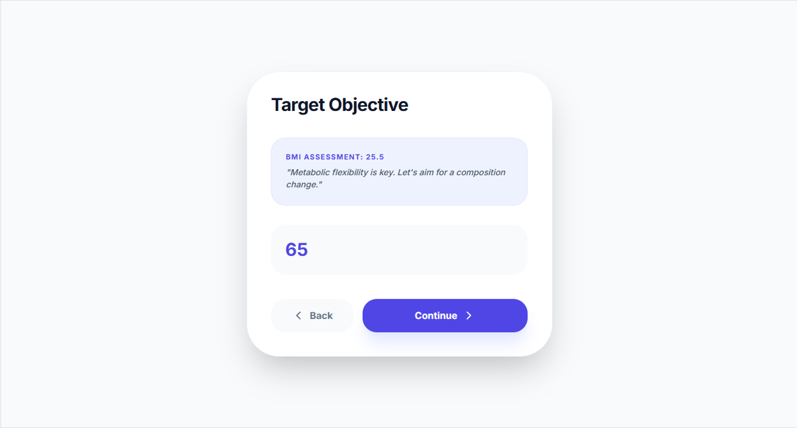
  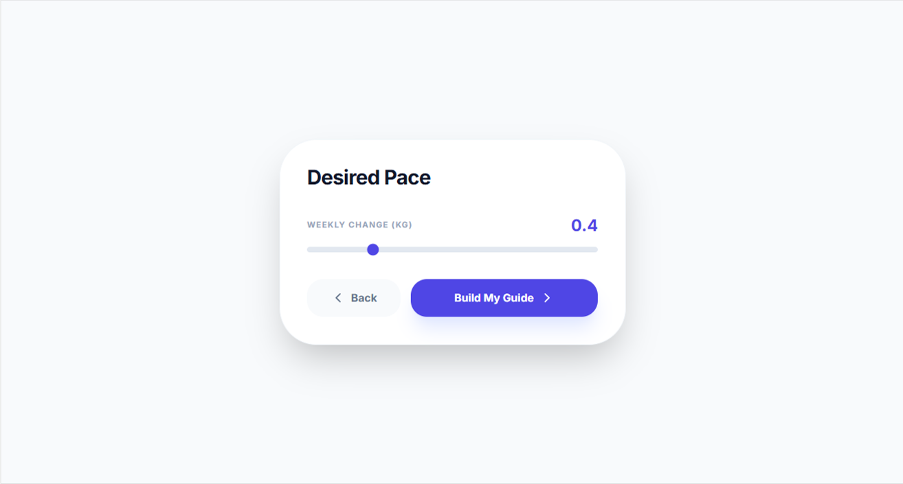
  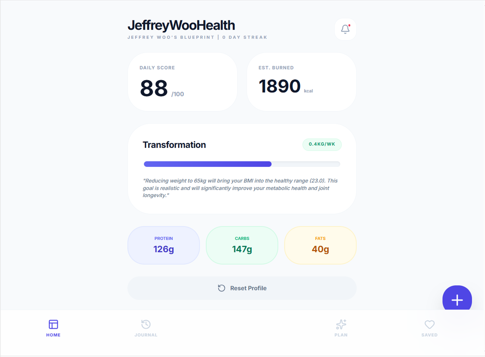
  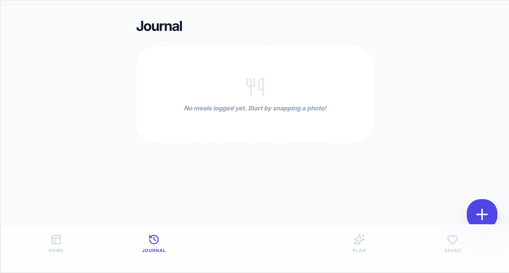
  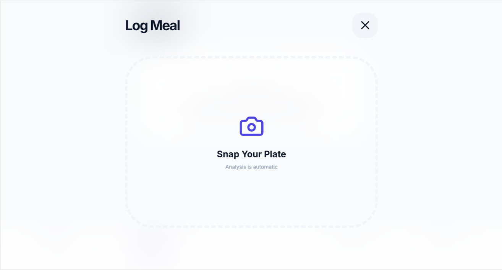
  
  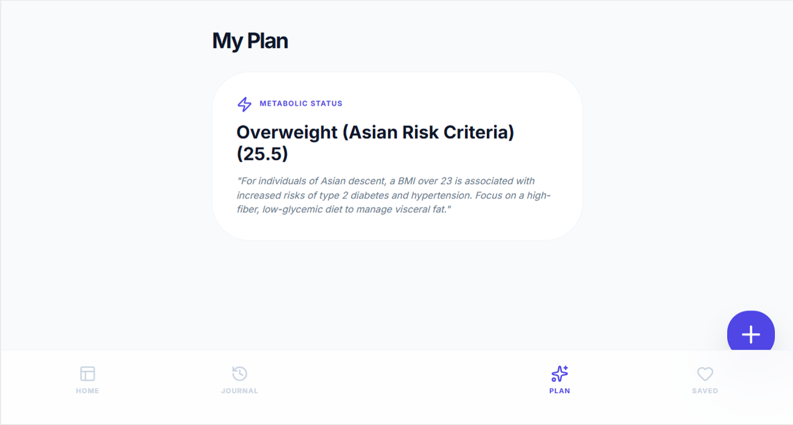
  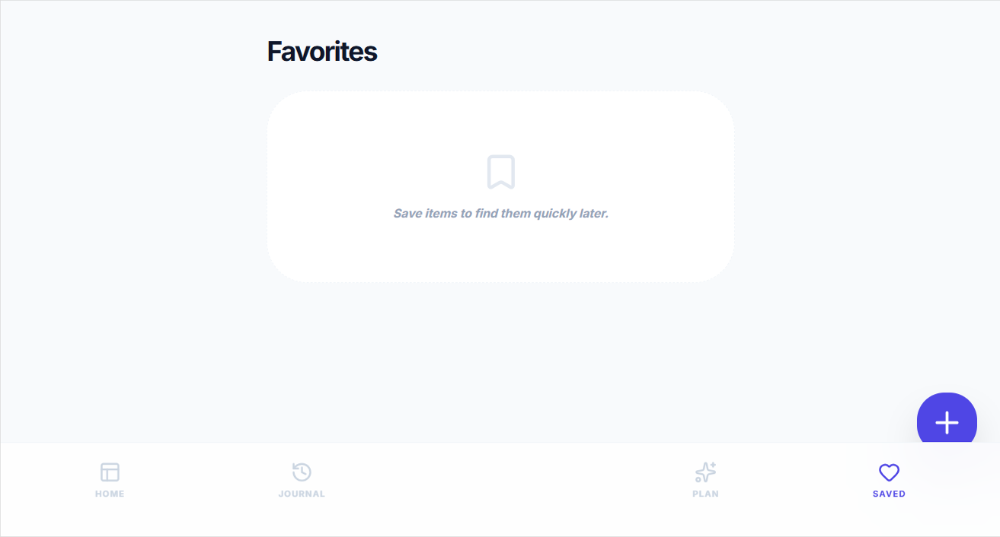
  
  
