

  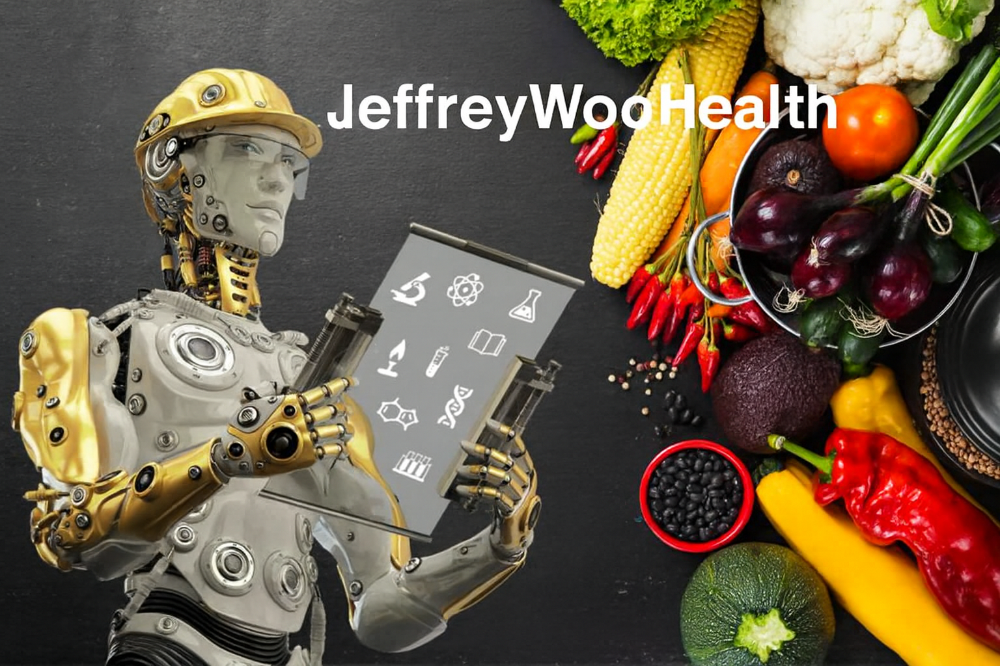

Not your typical health app!

**JeffreyWooHealth** is an AI-powered wellness & nutrition app designed to help users/staff make smarter health choices. By combining advanced artificial intelligence with practical nutrition insights. It analyzes food, lifestyle & wellness data to deliver personalized recommendations. Its goal is to empower users/staff to improve their daily habits, track progress, & achieve healthier living through technology-driven guidance.

## 🌍 Workforce Impact
Enhancing employee health isn’t just personal—it’s strategic.  
- Lower corporate medical & insurance costs  
- Boost productivity & engagement  
- Strengthen overall operations & sustainable business performance

## ✨ What Makes It Different
Most apps just count calories. **JeffreyWooHealth** goes further:  
- 🧠 **Personalized Plans** — tailored to your lifestyle and goals  
- 📸 **Snap & Track** — take a photo of your meal or scan a nutrition label for instant AI analysis  
- 📊 **Smarter Insights** — see your nutrition score, macros, and more — beyond just numbers  
- 💪 **Sustainable Habits** — tools to help you lose weight, gain muscle, or maintain balance  

## 🚀 Why Choose JeffreyWooHealth
Whether you want to slim down, build strength, or simply live better every day, **JeffreyWooHealth** is your AI-powered guide to lasting wellness. It’s based on experts' advice, works everywhere, and keeps your data secure for privacy.

## 📦 Getting Started
1. Upload or take a photo of your meal
2. Run **JeffreyWooHealth** to generate AI-powered nutrition insights
3. Track progress toward your health goals

## 🤖 Tech Stack
- **Language** — TypeScript, HTML  
- **Framework** — React (with Vite as the build tool)  
- **UI** — Standard React components, styled via JSX/TSX
- **Runtime** — Node.js

## 🍎 Nutritionist Theories Applied
- **Macronutrient Balance (Carbohydrates, Proteins, Fats)**  
The app uses AI to recommend balanced macronutrient ratios based on Recommended Dietary Allowances (RDA) and Acceptable Macronutrient Distribution Ranges (AMDR), ensuring energy needs are met for fitness goals.  
- **Basal Metabolic Rate (BMR) & Total Energy Expenditure (TEE)**  
By applying Harris-Benedict and Mifflin-St Jeor equations, the app estimates caloric requirements, adjusting for activity levels to guide weight management strategies.  
- **Glycemic Index & Load**  
The app incorporates glycemic control principles, helping users choose foods that stabilize blood sugar and reduce long-term metabolic risks.  
- **Dietary Reference Intakes (DRIs)**  
AI recommendations align with the World Health Organization (WHO) and the Food and Agriculture Organization (FAO) guidelines, ensuring micronutrient sufficiency (vitamins, minerals) for overall health.  
- **Nutritional Epidemiology Insights**  
The app leverages population-level findings (e.g., Mediterranean diet benefits, Dietary Approaches to Stop Hypertension "DASH" diet) to tailor recommendations to user profiles.  
- **Behavioral Nutrition Models**  
Inspired by Social Cognitive Theory and Health Belief Model, the app nudges users toward sustainable eating habits, not just short-term diets.

## 💡Transformation Impact
This project demonstrates how innovation can reshape personal wellness management by:  
- Digitizing lifestyle & nutrition workflows with AI‑driven analysis.  
- Empowering individuals to make informed, healthier decisions through personalized recommendations.  
- Enhancing engagement & accountability with interactive dashboards & progress tracking.  
- Driving digital transformation in health by turning raw data into actionable insights.  
- Promoting responsible innovation with secure handling of sensitive health information.

## ⭐ Skills Strengthened
- Full‑stack architecture for AI‑driven applications.  
- Secure handling of sensitive health data with environment variables.  
- AI model integration into real‑world health analysis workflows.  
- File parsing & structured data transformation for actionable insights.  
- State management in React (TypeScript + Vite) for interactive dashboards.

## ⚖️ Disclaimer
**JeffreyWooHealth** provides AI-driven insights for informational purposes only. It does not offer medical advice, diagnosis, or treatment. Please consult qualified healthcare providers or professional nutritionists before making health-related decisions.

## ⚙️ Run Locally

**Prerequisites:**  Node.js

1. Install dependencies:
   `npm install`
2. Set the `GEMINI_API_KEY` in [.env.local](.env.local) file after you create [.env.local](.env.local) file
3. Run the app:
   `npm run dev`

## 📋 Sample

  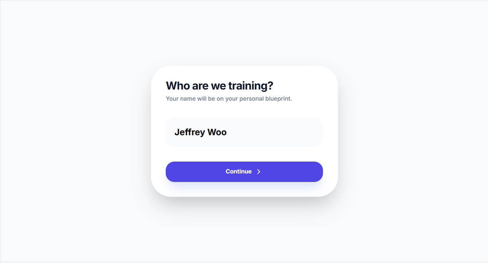
  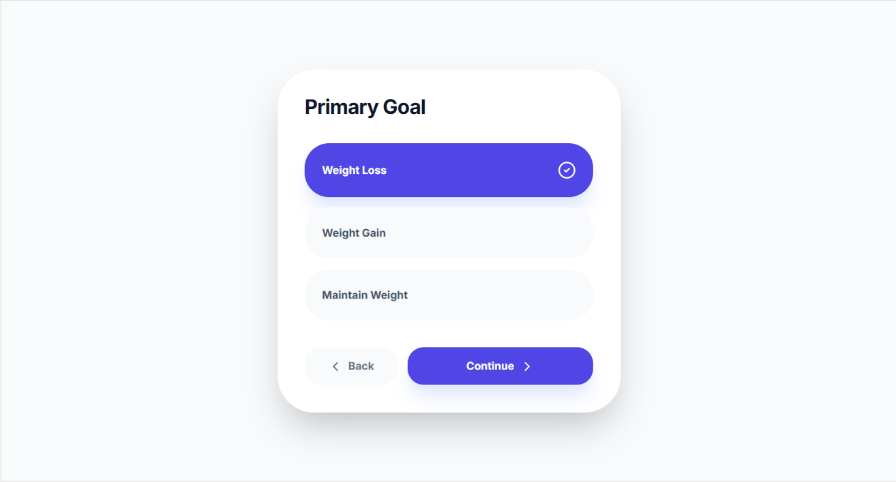
  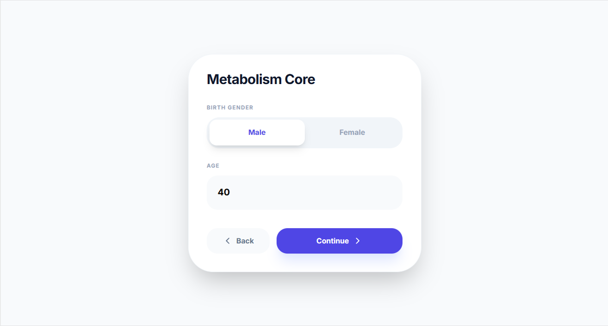
  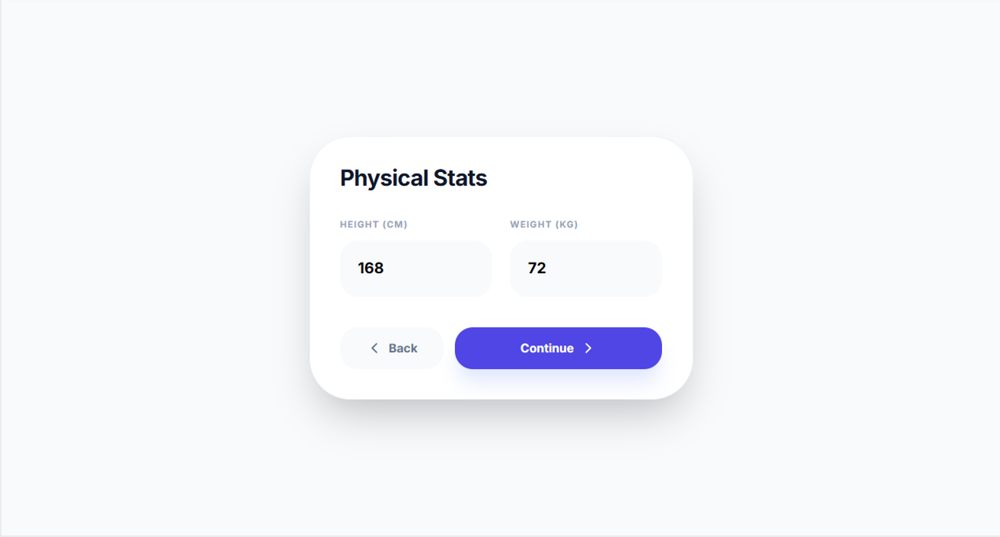
  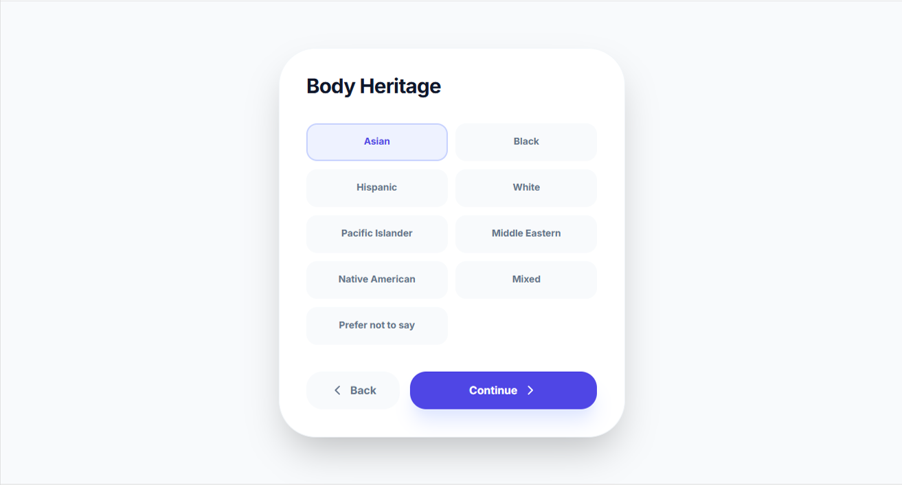
  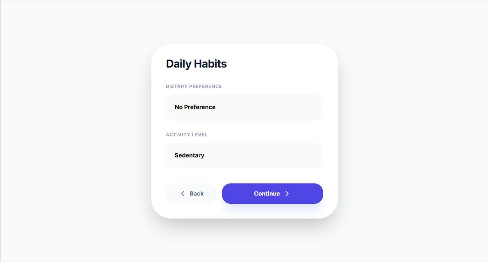
  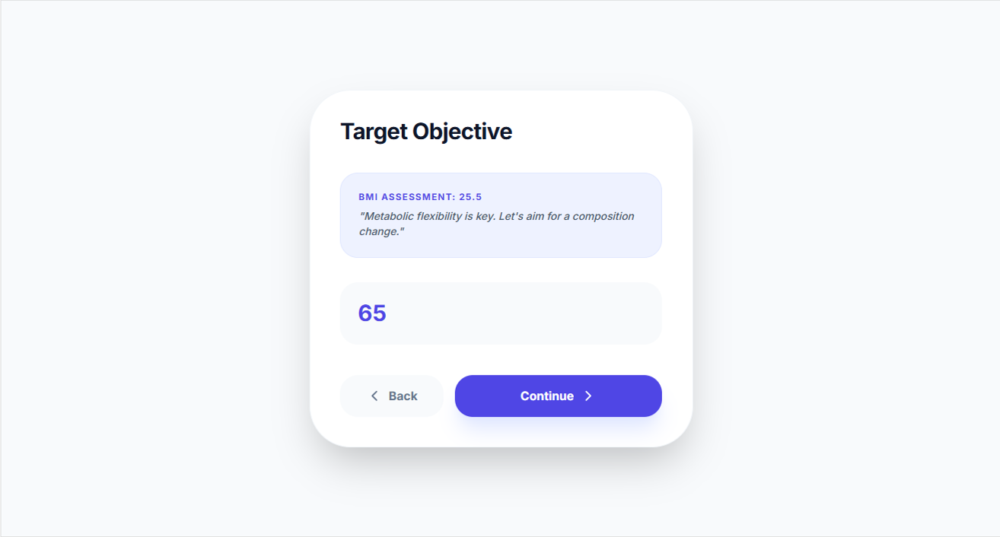
  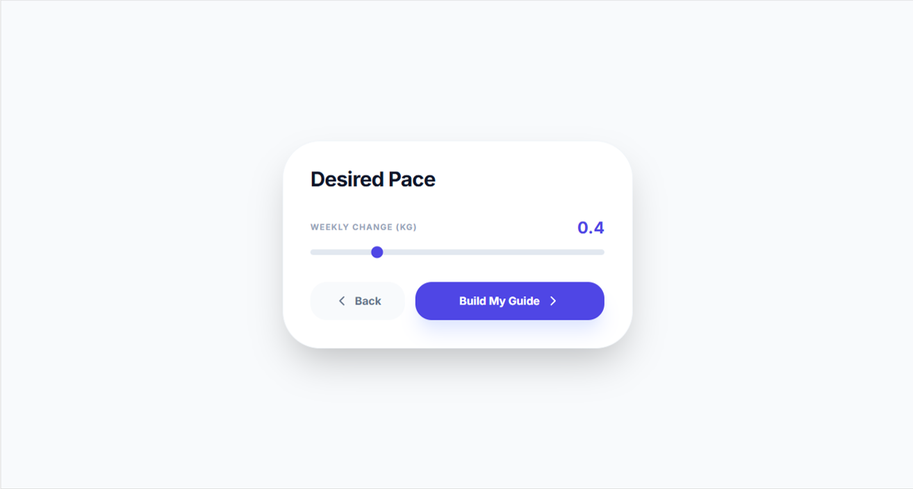
  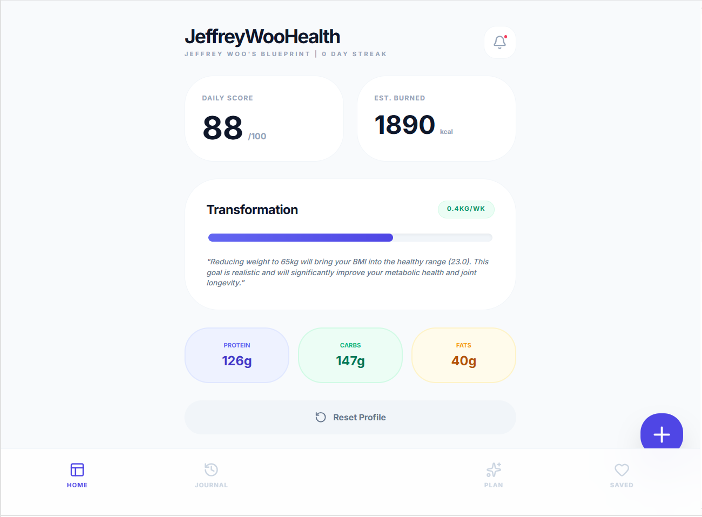
  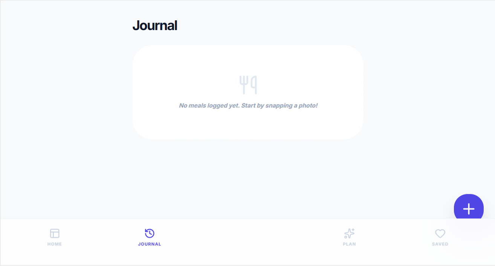
  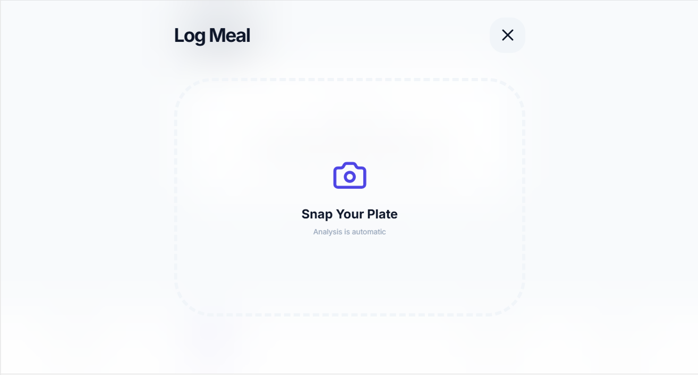
  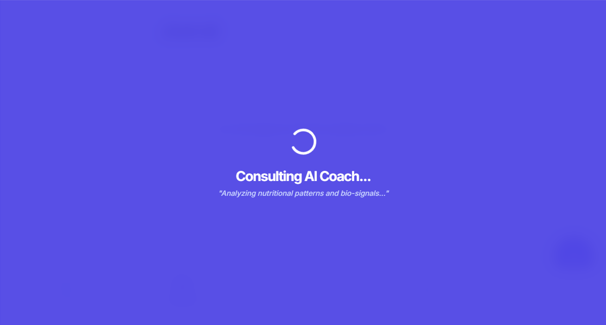
  
  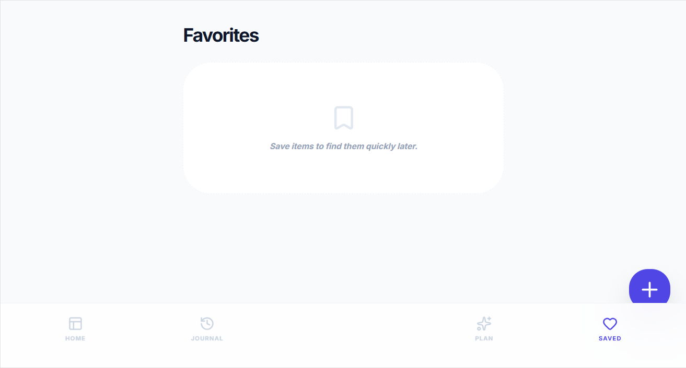
  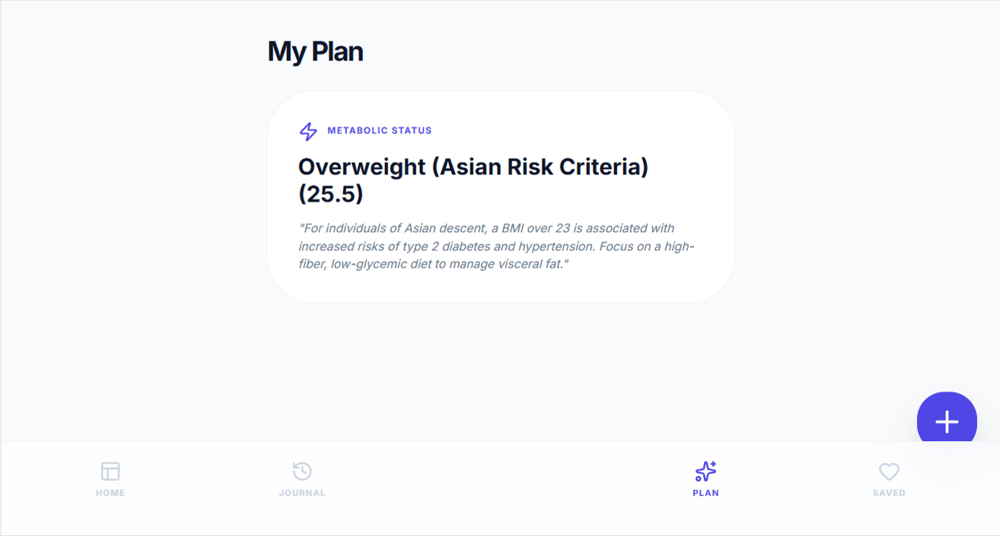
  
