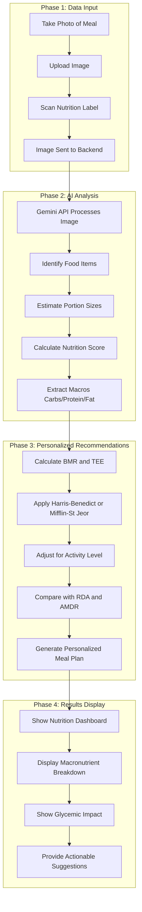

  

## 📊 Overview

> **Not your typical health app!**

**JeffreyWooHealth** is an AI-powered wellness & nutrition app designed to help users/staff make smarter health choices. By combining advanced artificial intelligence with practical nutrition insights. It analyzes food, lifestyle & wellness data to deliver personalized recommendations. Its goal is to empower users/staff to improve their daily habits, track progress, & achieve healthier living through technology-driven guidance.

## 🌍 Workforce Impact
Enhancing employee health isn’t just personal—it’s strategic.  
- Lower corporate medical & insurance costs  
- Boost productivity & engagement  
- Strengthen overall operations & sustainable business performance

## ✨ What Makes It Different
Most apps just count calories. **JeffreyWooHealth** goes further:  
- 🧠 **Personalized Plans** — tailored to your lifestyle and goals  
- 📸 **Snap & Track** — take a photo of your meal or scan a nutrition label for instant AI analysis  
- 📊 **Smarter Insights** — see your nutrition score, macros, and more — beyond just numbers  
- 💪 **Sustainable Habits** — tools to help you lose weight, gain muscle, or maintain balance  

## 💡Transformation Impact
This project demonstrates how innovation can reshape personal wellness management by:  
- Digitizing lifestyle & nutrition workflows with AI‑driven analysis.  
- Empowering individuals to make informed, healthier decisions through personalized recommendations.  
- Enhancing engagement & accountability with interactive dashboards & progress tracking.  
- Driving digital transformation in health by turning raw data into actionable insights.  
- Promoting responsible innovation with secure handling of sensitive health information.

## 🚀 Why Choose JeffreyWooHealth
Whether you want to slim down, build strength, or simply live better every day, **JeffreyWooHealth** is your AI-powered guide to lasting wellness. It’s based on experts' advice, works everywhere, and keeps your data secure for privacy.

## 🍎 Nutritionist Theories Applied
- **Macronutrient Balance (Carbohydrates, Proteins, Fats)**  
The app uses AI to recommend balanced macronutrient ratios based on Recommended Dietary Allowances (RDA) and Acceptable Macronutrient Distribution Ranges (AMDR), ensuring energy needs are met for fitness goals.  
- **Basal Metabolic Rate (BMR) & Total Energy Expenditure (TEE)**  
By applying Harris-Benedict and Mifflin-St Jeor equations, the app estimates caloric requirements, adjusting for activity levels to guide weight management strategies.  
- **Glycemic Index & Load**  
The app incorporates glycemic control principles, helping users choose foods that stabilize blood sugar and reduce long-term metabolic risks.  
- **Dietary Reference Intakes (DRIs)**  
AI recommendations align with the World Health Organization (WHO) and the Food and Agriculture Organization (FAO) guidelines, ensuring micronutrient sufficiency (vitamins, minerals) for overall health.  
- **Nutritional Epidemiology Insights**  
The app leverages population-level findings (e.g., Mediterranean diet benefits, Dietary Approaches to Stop Hypertension "DASH" diet) to tailor recommendations to user profiles.  
- **Behavioral Nutrition Models**  
Inspired by Social Cognitive Theory and Health Belief Model, the app nudges users toward sustainable eating habits, not just short-term diets.

## ⭐ Skills Strengthened
- Full‑stack architecture for AI‑driven applications.  
- Secure handling of sensitive health data with environment variables.  
- AI model integration into real‑world health analysis workflows.  
- File parsing & structured data transformation for actionable insights.  
- State management in React (TypeScript + Vite) for interactive dashboards.

## 🤖 Tech Stack
- **Language** — TypeScript, HTML  
- **Framework** — React (with Vite as the build tool)  
- **UI** — Standard React components, styled via JSX/TSX
- **Runtime** — Node.js

## 📦 Getting Started
1. Upload or take a photo of your meal
2. Run **JeffreyWooHealth** to generate AI-powered nutrition insights
3. Track progress toward your health goals

## ⚙️ Run Locally

**Prerequisites:**  Node.js

1. Install dependencies:
   `npm install`
2. Set the `GEMINI_API_KEY` in [.env.local](.env.local) file after you create [.env.local](.env.local) file
3. Run the app:
   `npm run dev`

## 📋 Sample

  
  
  
  
  
  
  
  
  
  
  
  
  
  
  
  

## 📐Data Flow and Logic Sequence

```mermaid
flowchart TD
    subgraph PHASE1["Phase 1: Data Input"]
        direction TB
        A1["Take Photo of Meal"] --> A2["Upload Image"]
        A2 --> A3["Scan Nutrition Label"]
        A3 --> A4["Image Sent to Backend"]
    end

    subgraph PHASE2["Phase 2: AI Analysis"]
        direction TB
        B1["Gemini API Processes Image"] --> B2["Identify Food Items"]
        B2 --> B3["Estimate Portion Sizes"]
        B3 --> B4["Calculate Nutrition Score"]
        B4 --> B5["Extract Macros Carbs/Protein/Fat"]
    end

    subgraph PHASE3["Phase 3: Personalized Recommendations"]
        direction TB
        C1["Calculate BMR and TEE"] --> C2["Apply Harris-Benedict or Mifflin-St Jeor"]
        C2 --> C3["Adjust for Activity Level"]
        C3 --> C4["Compare with RDA and AMDR"]
        C4 --> C5["Generate Personalized Meal Plan"]
    end

    subgraph PHASE4["Phase 4: Results Display"]
        direction TB
        D1["Show Nutrition Dashboard"] --> D2["Display Macronutrient Breakdown"]
        D2 --> D3["Show Glycemic Impact"]
        D3 --> D4["Provide Actionable Suggestions"]
    end

    A4 --> B1
    B5 --> C1
    C5 --> D1
```

## ⚖️ Disclaimer
**JeffreyWooHealth** provides AI-driven insights for informational, educational, and demonstration purposes only. It does not constitute professional medical advice, diagnosis, or treatment.

The AI‑generated insights, suggestions, or analyses are based on models that may produce inaccurate, incomplete, or inappropriate outputs. They are not a substitute for professional medical judgment.

Please always consult qualified healthcare providers or professional nutritionists before making health-related decisions or changes to your lifestyle, diet, or medication. The developer assumes no liability for any injuries, losses, or damages arising from the use of this app.

Do not use this application in emergencies. If you have a medical emergency, contact your local emergency services immediately.

Use at your own risk.

## 📄 License

**GNU Affero General Public License v3.0 (AGPL‑3.0)** — JeffreyWooHealth 

- ✅ You are free to use, modify, and distribute this software, provided that any derivative works are also licensed under AGPL‑3.0.
- ✅ If you run or deploy this software over a network (e.g., as a web service), you must make the source code of your modified version available to all users who interact with it.
- ✅ This ensures transparency, collaboration, and continued open‑source availability of improvements.
- ❌ The software is provided “as is”, without warranties of any kind.

For full details, see the [LICENSE](./LICENSE) file.

## 👤 About the Author
Jeffrey Woo — Finance Manager | Strategic FP&A, AI Automation & Cost Optimization | MBA | FCCA | CTA | FTIHK | SAP Financial Accounting (FI) Certified Application Associate | Xero Advisor Certified

📧 Email: jeffreywoocf@gmail.com  
💼 LinkedIn: https://www.linkedin.com/in/wcfjeffrey/  
🐙 GitHub: https://github.com/wcfjeffrey/
